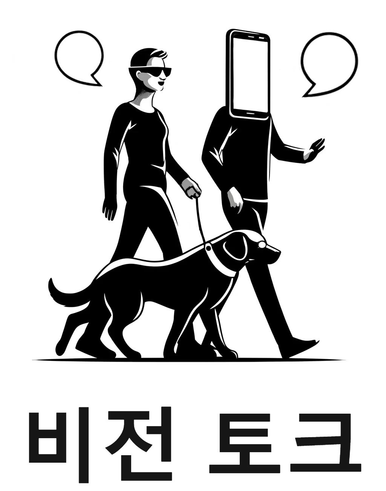

# 비전토크 (VisionTalk)

## 소개
**비전토크**는 시각 장애인과 읽기 장애가 있는 사용자를 위해 개발된 안드로이드 앱입니다. 사용자가 촬영한 사진에서 객체를 인식하고, 색상을 식별하며, 텍스트를 읽어 오디오 설명을 제공함으로써 주변 세계에 대한 이해를 높이고자 합니다.

## 주요 기능
1. **객체 인식 및 음성 설명**
   - 커스텀 학습된 CNN 모델을 사용하여 사진 속 객체를 인식하고, 음성으로 설명해주는 기능을 제공합니다.

2. **색상 인식 및 음성 설명**
   - 사진에서 주요 색상을 식별하고, 색상 정보를 음성으로 설명합니다.

3. **텍스트 음성 변환 (OCR)**
   - 사진에 포함된 텍스트를 음성으로 변환하여 시각 정보에 접근할 수 있도록 도와줍니다.

4. **바코드 인식 및 음성 설명**
   - 바코드를 인식하여 물건에 대한 정보를 음성으로 제공합니다.

5. **알약 인식 및 음성 설명**
   - 알약을 인식하고 알약에 대한 정보를 음성으로 제공합니다.

7. **음성 응답의 속도 및 톤 조절**
   - 사용자 편의를 위해 음성 응답의 속도 및 톤을 조절할 수 있습니다.

## 개발 배경 및 필요성
**비전토크**는 시각 장애인과 읽기 장애를 겪는 사용자들이 시각적 정보를 오디오로 쉽게 변환하여 접근성을 높이고, 독립적으로 생활할 수 있도록 돕기 위해 개발되었습니다. 현대 사회에서 정보 접근성은 자립과 독립성을 향상시키는 핵심 요소로서, 이 앱을 통해 사용자들은 일상에서 겪는 정보 접근의 어려움을 해결할 수 있습니다.

## 구현 일정
| 일정  | 내용                                     |
|-------|----------------------------------------|
| 3월   | 아이디어 회의 및 주제 선정, 보고서 작성 |
| 4월   | 개발 환경 선정 및 구축                    |
| 5월   | 이미지 처리 파이프라인 구축 및 CNN 모델 훈련 |
| 6월~8월 | 개선사항 추가 및 인터페이스 개발          |
| 9월   | 통합 및 시스템 테스트                     |
| 10월  | 최종 보완 작업 및 마무리                   |

## 구현 분담
- **김태민 (팀장)**
  - 기획, 보고서 작성, 개발 환경 및 DB 구축, 이미지 처리 및 기계 모델 학습 개발, 앱 인터페이스 개발, 통합 및 시스템 테스트

## 결론
- **시스템의 효용성 및 기대효과**: "비전토크" 앱은 시각 장애인과 읽기 장애를 겪는 사용자들에게 일상 생활에서 정보를 얻는 데 큰 도움을 줄 수 있습니다.
